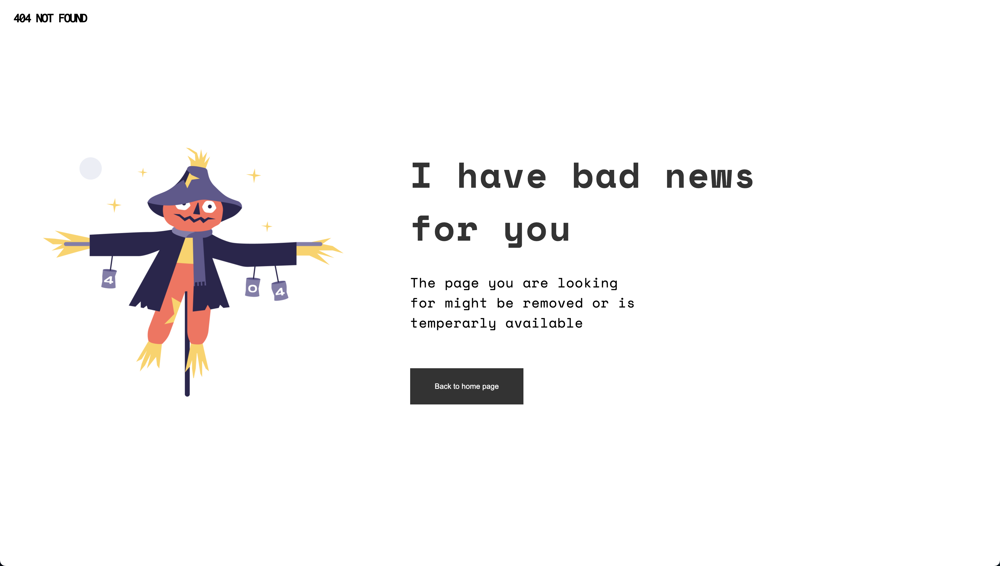
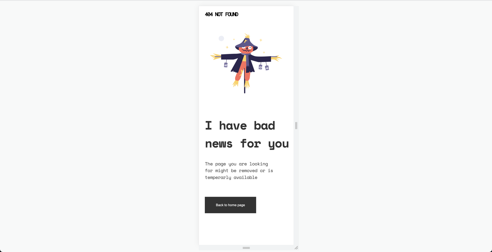

# 404-not-found-master

Today I complete the 404 challenge from devchallenges.
To complete this challenge I use only pure CSS. No flexbox or grid. 
I spend some extra time learning more about the position property. Even though I had some understanding with position, I wanted to find a way to move things around without always using flexbox. 

## Screenshots

 
